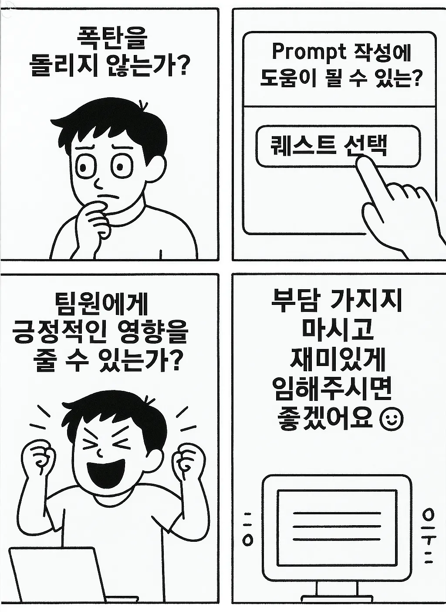

# README.md

퀘스트 선정 고민을 다음과 같이 정했어요.

- 폭탄을 돌리지 않는가?
- Prompt 작성에 도움이 될 수 있는가?
- AI를 효과적으로 사용했는가?
- 일상에서 자연스럽게 사용할 수 있는가?
- 팀원에게 긍정적인 영향을 줄 수 있는가?

위 요소들을 기반으로 퀘스트에 대한 초안을 잡기 시작했어요.

완벽한 퀘스트를 전달하기 보다는 퀘스트 내에서 수행자가 고민할 여지를 남겨두고 개선을 하길 바랐습니다.

그 속에서 Prompt를 학습하는 방법들을 체화하고 성장할 수 있는 기회로 여겨질 수 있겠죠?

또한 자신만 바라보지 않고 그 긍정적인 영향을 팀원들에게도 넘어서 커뮤니티에도 전파할 수 있길 바라요.

저희가 정한 퀘스트들을 수행하실때 부담가지지 마시고 재미있게 임해주시면 좋겠어요 😊

위 그림을 보고 어떤 불편함이 떠오르시나요? ⇒ 한번 적용해보세요!
